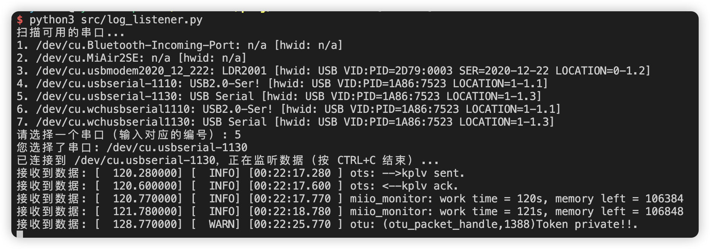

# XIAOMI IOT DEVICE MOCK
参考小米IoT开发平台->个人开发者->[固件开发指南](https://iot.mi.com/v2/new/doc/resources-and-services/personal-developer/embedded-dev#%E8%AE%BE%E5%A4%87%E6%8E%A7%E5%88%B6)，使用python3串口模拟MCU对接小米IOT模块

## 说明
日志监听脚本 log_listener.py : 实现了扫描当前系统所有串口，供用户选择后持续输出监听到的串口打印。

设备仿真脚本 device_emulation.py : 参考官方流程说明，以小米个人开发者模板设备 perdev.switch.004 为例，实现基本设置、APP控制响应、随机更新开关状态。

## 使用
1. 安装Python3
2. 安装依赖包 `pip install pyserial`
3. 将小米IoT模组和串口板连接，都连上电脑

4. 运行日志监听脚本 `python3 src/log_listener.py `，选择串口

5. 运行设备仿真脚本 `python3 src/device_emulation.py`，选择串口
